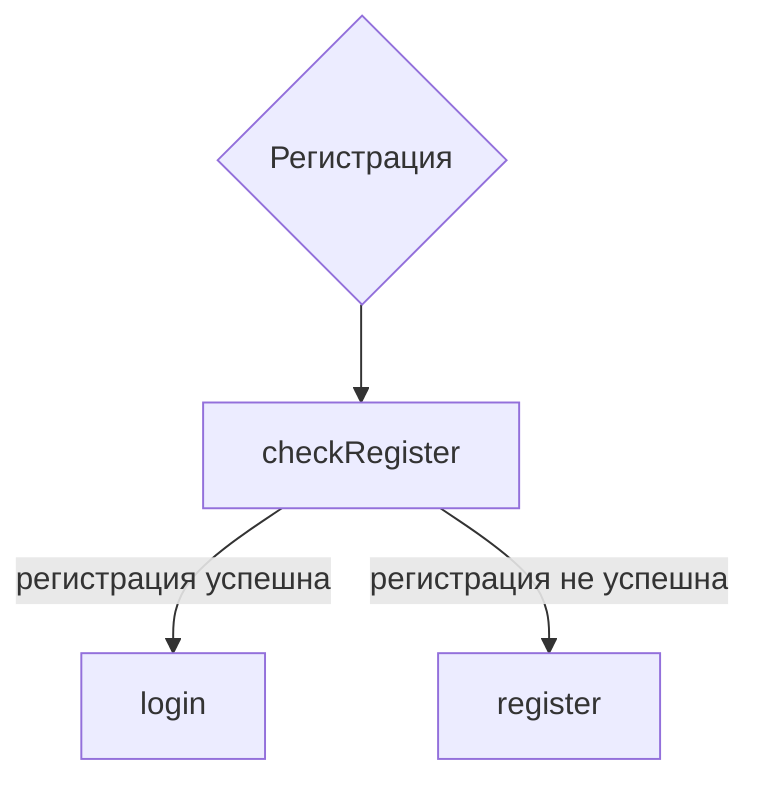

# PHP / Регистрация
## Структура перехода по страницам


## Передача данных
* Из формы `registerForm.php` -> `checkRegister.php`
  * Основные переменные (в разделе *"Обработка данных формы"*)
* Из `checkRegister.php` -> `login.php`:
  <details>
  <summary>
  login.php
  </summary>
  
  ```
  // Возвращаемся из registerForm.php с инфой о том, что мы зарегались, или ничего не отображаем, если мы тут впервые
  <p class="login-form__valid">
    <?php
      if (isset($_SESSION['iAmRegister']) && $_SE['iAmRegister'] === 'on') {
        echo "Регистрация прошла успешно! Тепможноавторизоваться:";
        $_SESSION['iAmRegister'] = '';
      } else {
        echo "";
      }
    ?>
  </p>
  ```
  </details>
  
* Из `checkRegister.php` -> `register.php`:
  <details>
  <summary>
  register.php
  </summary>
  
  ```
  // Возвращаемся с инфой о том, что такой пользователь у нас уже есть, или не отображаем ничего
  <p class="alreadyExist incorrect-text" id="errorUser">
    <?php
      if (isset($_SESSION['alreadyExist']) && $['alreadyExist'] ===   true)   {
        echo "Пользователь с таким логином у нас уже естьПридумай     что-нибудь оригинальнее";
        $_SESSION['alreadyExist'] = false;
      } else {
        echo "";
      }
    ?>
  </p>
  ```
  </details>

## Обработка данных формы
<details>
<summary>
Запуск сессии
</summary>

```
session_start();
```

</details>

<details>
<summary>
Работа с переменными из `register.php`
</summary>

```
$login = filter_var(trim($_POST['registerLogin']));
$_SESSION['alreadyExist'] = false; // Для передачи в register.php / Если пользователь с таким login уже существует

$password = filter_var(trim($_POST['registerPassword']));
$password = md5($password."myBossIsGay"); // Хешируем

$fullAvatar = $_POST['avatar'];
$leftLeg = $_POST['leftLeg'];
$rightLeg = $_POST['rightLeg'];
$trousers = filter_var(trim($_POST['registerTrousers']));
$registerPotato = $_POST['registerPotato'];
$registerExperiments = $_POST['registerExperiments'];

$_SESSION['iAmRegister'] = $_POST['registerHealth']; // Для передачи в login.php / Сообщаем, что регистрация прошла успешно

$parseAvatar = parse_url($fullAvatar);
$avatar = isset($parseAvatar['path']) ? $parseAvatar['path'] : ''; // Сокращаем ссылку на аватарку

if ($registerPotato === "on") {
  $registerPotato = "1";
} else {
  $registerPotato = "0";
} // Любим ли мы картошку, конвертируем в понятный sql язык

if ($registerExperiments === "on") {
  $registerExperiments = "1";
} else {
  $registerExperiments = "0";
} // Проводили ли над нами опыты, конвертируем в понятный sql язык
```

</details>

<details>
<summary>
Подключаемся к SQL
</summary>

```
// подключаемся к SQL
$dataBase = new mysqli('localhost', 'root', '', 'KirGenDB');

// Подготовка запроса SQL, проверка списка login
$query = "SELECT * FROM `users` WHERE login = '$login'";

// Выполнение запроса к SQL по поводу login
$result = $dataBase->query($query);
```

</details>

<details>
<summary>
Обрабатываем результаты
</summary>

```
if ($result->num_rows > 0) { // Если такой пользователь уже существует, возвращаемся
  $_SESSION['alreadyExist'] = true;
  header('Location: /register.php');
  $dataBase->close();
} else { // Если такого пользователя ещё нет, создаём
  $dataBase->query("INSERT INTO `users` (`login`, `password`, `avatar`, `leftLeg`, `rightLeg`, `trousers`, `potato`, `experiments`, `health`, `item1`, `item2`, `item3`, `item4`, `item5`, `item6`, `item7`, `item8`, `item9`, `ending1`, `ending2`, `ending3`, `ending4`, `ending5`, `ending6`, `ending7`, `ending8`, `ending9`, `ending10`, `ending11`, `ending12`, `ending13`, `ending14`, `ending15`, `ending16`, `message`, `option1`, `option2`, `option3`, `option4`, `option5`, `option6`, `option7`, `option8`, `option9`, `option10`) VALUES ('$login', '$password', '$avatar', '$leftLeg', '$rightLeg', '$trousers', '$registerPotato', '$registerExperiments', '100', '0', '0', '0', '0', '0', '0', '0', '0', '0', '0', '0', '0', '0', '0', '0', '0', '0', '0', '0', '0', '0', '0', '0', '0', '0', '', '0', '0', '0', '0', '0', '0', '0', '0', '0', '0')");

  $dataBase->close();

  header('Location: /login.php');
}
```

</details>

## Задачи
### **Глобальные задачи**
- [x] задача 1
- [x] задача 2

***
[🠔 Вернуться к разделу разработки front-end](https://github.com/KirGenHeart/documentation/blob/main/front-end/front-end-dev.md)