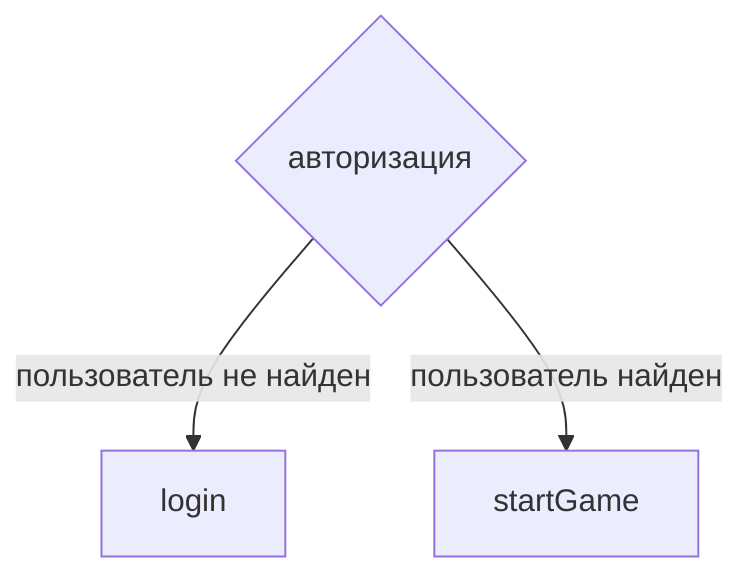
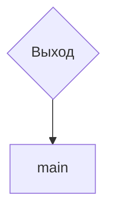

# PHP / Авторизция и выход
## Структура перехода по страницам
### Авторизация


### Выход из аккаунта


## Передача данных
### Авторизация
* Из формы `login.php` -> `auth.php`
  * Основные переменные (в разделе *"Обработка данных формы"*)
* Из `auth.php` -> `login.php`:
  <details>
  <summary>
  login.php
  </summary>
  
  ```
  // Если пользователь не существует
  <p class="login-form__cantFindUser incorrect-text">
  <?php
    if (isset($_SESSION['ICantFindUser']) && $_SES['ICantFindUser'] === true) {
      echo "Походу ты чёт не так ввёл. Не могу тебя найПопробуй ещё разок.";
      $_SESSION['ICantFindUser'] = false;
    } else {
      echo "";
    }
  ?>
  </p>
  ```
  </details>
  
### Выход из аккаунта

* Из `любой страницы (pop-up с достижениями)` -> `exit.php`.
  * Основные переменные (в разделе *"Обработка данных формы"*)
* Из `exit.php` -> `index.php`:
  * Тупа выходим из акка 

## Обработка данных формы (Авторизация)
<details>
<summary>
Запуск сессии
</summary>

```
session_start();
```

</details>

<details>
<summary>
Работа с переменными из `login.php`
</summary>

```
$login = filter_var(trim($_POST['loginLogin']));

$password = filter_var(trim($_POST['loginPassword']));
$password = md5($password . "myBossIsGay");

$_SESSION['ICantFindUser'] = false; // Если пользователь не найден
```

</details>

<details>
<summary>
Подключаемся к SQL
</summary>

```
// подключаемся к SQL
require "connect.php";
```

</details>

<details>
<summary>
Ищем пользователя с таким же login
</summary>

```
$result = $dataBase->query("SELECT * FROM `users` WHERE `login` = '$login' AND `password` = '$password';");
```

</details>

<details>
<summary>
Входим / не входим
</summary>

```
// Если такой пользователь у нас уже есть
$user = $result->fetch_assoc();
if (empty($user)) {
  $_SESSION['ICantFindUser'] = true;

  $dataBase->close();
  header('Location: ../login.php');
  exit();
} else { // Если такого пользователя у нас ещё нет
  // (название куки, что храним в куки, сколько храним, где используем ("/" - это весь сайт))
  // применение cookie: $_COOKIE['loginCookie'];
  setcookie('loginCookie', $user['login'], time() + 3600 * 24 * 30, "/");
  setcookie('avatarCookie', $user['avatar'], time() + 3600 * 24 * 30, "/");
  setcookie('leftLegCookie', $user['leftLeg'], time() + 3600 * 24 * 30, "/");
  setcookie('rightLegCookie', $user['rightLeg'], time() + 3600 * 24 * 30, "/");
  setcookie('trousersCookie', $user['trousers'], time() + 3600 * 24 * 30, "/");
  setcookie('potatoCookie', $user['potato'], time() + 3600 * 24 * 30, "/");
  setcookie('experimentsCookie', $user['experiments'], time() + 3600 * 24 * 30, "/");

  setcookie('ending1Cookie', $user['ending1'], time() + 3600 * 24 * 30, "/");
  setcookie('ending2Cookie', $user['ending2'], time() + 3600 * 24 * 30, "/");
  setcookie('ending3Cookie', $user['ending3'], time() + 3600 * 24 * 30, "/");
  setcookie('ending4Cookie', $user['ending4'], time() + 3600 * 24 * 30, "/");
  setcookie('ending5Cookie', $user['ending5'], time() + 3600 * 24 * 30, "/");
  setcookie('ending6Cookie', $user['ending6'], time() + 3600 * 24 * 30, "/");
  setcookie('ending7Cookie', $user['ending7'], time() + 3600 * 24 * 30, "/");
  setcookie('ending8Cookie', $user['ending8'], time() + 3600 * 24 * 30, "/");
  setcookie('ending9Cookie', $user['ending9'], time() + 3600 * 24 * 30, "/");
  setcookie('ending10Cookie', $user['ending10'], time() + 3600 * 24 * 30, "/");
  setcookie('ending11Cookie', $user['ending11'], time() + 3600 * 24 * 30, "/");
  setcookie('ending12Cookie', $user['ending12'], time() + 3600 * 24 * 30, "/");
  setcookie('ending13Cookie', $user['ending13'], time() + 3600 * 24 * 30, "/");
  setcookie('ending14Cookie', $user['ending14'], time() + 3600 * 24 * 30, "/");
  setcookie('ending15Cookie', $user['ending15'], time() + 3600 * 24 * 30, "/");
  setcookie('ending16Cookie', $user['ending16'], time() + 3600 * 24 * 30, "/");

  $dataBase->close();
  header('Location: ../startGame.php');
  exit();
}
```

</details>

## Обработка данных формы (Выход)
<details>
<summary>
Выходим = очищаем все куки
</summary>

```
<?php
session_start();

  setcookie('loginCookie', '', time() - (3600 * 24 * 30), "/");
  setcookie('avatarCookie', '', time() - (3600 * 24 * 30), "/");
  setcookie('leftLegCookie', '', time() - (3600 * 24 * 30), "/");
  setcookie('rightLegCookie', '', time() - (3600 * 24 * 30), "/");
  setcookie('trousersCookie', '', time() - (3600 * 24 * 30), "/");
  setcookie('potatoCookie', '', time() - (3600 * 24 * 30), "/");
  setcookie('experimentsCookie', '', time() - (3600 * 24 * 30), "/");

  setcookie('ending1Cookie', '', time() - (3600 * 24 * 30), "/");
  setcookie('ending2Cookie', '', time() - (3600 * 24 * 30), "/");
  setcookie('ending3Cookie', '', time() - (3600 * 24 * 30), "/");
  setcookie('ending4Cookie', '', time() - (3600 * 24 * 30), "/");
  setcookie('ending5Cookie', '', time() - (3600 * 24 * 30), "/");
  setcookie('ending6Cookie', '', time() - (3600 * 24 * 30), "/");
  setcookie('ending7Cookie', '', time() - (3600 * 24 * 30), "/");
  setcookie('ending8Cookie', '', time() - (3600 * 24 * 30), "/");
  setcookie('ending9Cookie', '', time() - (3600 * 24 * 30), "/");
  setcookie('ending10Cookie', '', time() - (3600 * 24 * 30), "/");
  setcookie('ending11Cookie', '', time() - (3600 * 24 * 30), "/");
  setcookie('ending12Cookie', '', time() - (3600 * 24 * 30), "/");
  setcookie('ending13Cookie', '', time() - (3600 * 24 * 30), "/");
  setcookie('ending14Cookie', '', time() - (3600 * 24 * 30), "/");
  setcookie('ending15Cookie', '', time() - (3600 * 24 * 30), "/");
  setcookie('ending16Cookie', '', time() - (3600 * 24 * 30), "/");
  
  header('Location: /');
?>
```

</details>

## Задачи:
- [x] Ставить аватар полльзователя, если он авторизован
  <details>
  <summary>
  Реализация
  </summary>

  ```
  <button class="header__user inputButton"id="achivmentsOptitle="
    <?php
      if (isset($_COOKIE['loginCookie']) && $_CO['loginCookie'] !== '')   {
        echo ($_COOKIE['loginCookie']);
      } else {
        echo 'Неавторизированный пользователь';
      }
    ?>
  ">
    
    " alt="Аватар пользователя">
  </button>
  ```

  </details>
- [x] Прочекать заполнение и очищение всех кукисов
- [x] Инклюдить достижения в pop-up, если мы залогинены. Как мы поймём, что хоть одна концовка у нас открыта? Давай Option1 под это дело задействуем.
  <details>
  <summary>
  порядок действий
  </summary>

  * Если не залогинены - приглашение залогиниться
  * Если залогинены, но концовок нет - 
    * пересчитываем все `ending`, если в результате получаем 0, то и в `option1` получаем 0, сообщаем, что пока что достижений у нас нет.
    * пересчитываем все `ending`, если в результате получаем >0, то инклюдим страницу с достижениями.

  </details>
  <details>
  <summary>
  Реализация
  </summary>

  ```
  // Проверяем, есть ли уже какие-то достижения:
  $_COOKIE['option1Cookie'] = $_COOKIE['ending1Cookie'] + $_COOKI['ending2Cookie'] + $_COOKIE['ending3Cookie'] + $_COOKI['ending4Cookie'] + $_COOKIE['ending5Cookie'] + $_COOKI['ending6Cookie'] + $_COOKIE['ending7Cookie'] + $_COOKI['ending8Cookie'] + $_COOKIE['ending9Cookie'] + $_COOKI['ending10Cookie'] + $_COOKIE['ending11Cookie'] + $_COOKI['ending12Cookie'] + $_COOKIE['ending13Cookie'] + $_COOKI['ending14Cookie'] + $_COOKIE['ending15Cookie'] + $_COOKI['ending16Cookie'];

  // Если нет
  <?php
  if ($_COOKIE['option1Cookie'] === 0):
  ?>
    <p class="tac">
      <?php
        echo $_COOKIE['loginCookie'] . ', у тебя пока что нет достижений((';
      ?>
    </p>

  // Если есть - пример отображения концовки
  <?php
    if ($_COOKIE['ending3Cookie'] === '1'):
      ?>
      <button class="achivment-item achivment-negative">
        
        Section 3
      </button>
      <div class="achivment-item__description">
        <p>Curabitur eget lorem id massa consequat sagittis.</p>
      </div>
    <?php else: ?>
      
    <?php endif; ?>

  <?php endif; ?>
  ```

  </details>
- [x] Разобраться с отображением достижений.
  <details>
  <summary>
  Реализация:
  </summary>

  ```
      <section class="achivments" id="achivmentsPopUp">
      <button class="achivments__close inputButton" id="achivmentsClose">X</button>

      <?php
      if (isset($_COOKIE['loginCookie']) && $_COOKIE['loginCookie'] !== ''):
        ?>
        <?php
        require 'achivments.php';
        ?>
      <?php else: ?>
        <p class="achivments__text">Дружище, ты не аторизован. Чтобы узреть свои достжения,
          <a href="login.php">Авторизируйся</a>
        </p>
      <? endif; ?>
    </section>
  ```

  </details>
- [x] Если мы залогинены, то при нажатии на `начать игру` на главной мы переходим не в `login`, а в `startGame`.
  <details>
  <summary>
  На странице index.html
  </summary>

  ```
  // Вверху:
  <a class=" inputmain-description__register-btn" href="
    <?php
      if (isset($_COOKIE['loginCookie']) && $['loginCookie'] !== '') {
        echo 'startGame.php';
      } else {
        echo 'login.php';
      }
      ?>
      ">
    Начать игру
  </a>
  ```
  ```
  // И внизу
  <a class="inputButton main-start__btn" href="
    <?php
      if (isset($_COOKIE['loginCookie']) && $_C['loginCookie'] !=='') {
        echo 'startGame.php';
      } else {
        echo 'login.php';
      }
      ?>
    ">
    Начать игру
  </a>
  ```

  </details>

- [x] Если мы авторизованы, то не можем перейти по ссылкам login и register
  <details>
  <summary>
  Реализация:
  </summary>

  ```
  // Когда входим в body
  <body>
  <?php
  if (isset($_COOKIE['loginCookie']) && $_COOKIE['loginCookie'] !== ''):
    ?>
    <?php
    header('Location: index.php');
    ?>
  <?php else: ?>

  // Весь остальной код страницы

  <?php endif; ?>
  </body>
  ```
  </details>

***
[🠔 Вернуться к разделу разработки back-end](https://github.com/KirGenHeart/documentation/blob/main/back-end/back-end-dev.md)