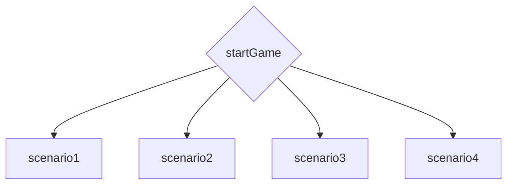

# StartGame - первая игровая страница
## Структура сраницы
<details>
<summary>StartGame</summary>

```
// позже
```

</details>

## Файловая структура страницы
* Страница в `pages/startGame` - но это временно, т.к. на серванте будет перенесена в `game/startGame.html`
* Стили в `scss/game.css`
* Инклюды в `components/game/startGame`
* картинки в `images/game/StartGame`
* Картинки инвенторя: `images/game/inventory`
* Скрипт инвенторя для мобилки: `js/mobileInventory.js`

## Ссылки и переходы


## Задачи
- [x] Сверстать по шаблону startGame, он же будет глобальным шаблоном для всех игровых страниц игры.
- [x] адаптивчик для мобилы конечно же. *Пиздец как это было сложно*

## Для бэк-енда
1. Не забудь, за несанкционированный вход - посылаем нахуй.
***
[🠔 Вернуться к разделу разработки front-end](https://github.com/KirGenHeart/documentation/blob/main/front-end/front-end-dev.md)