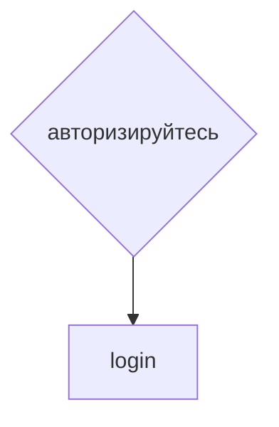

# achivments (достижения)
## Структура pop-up achivments
<details>
<summary>Не авторизован</summary>

```
achivments
  achivments__close
  achivments__title
  achivments__text

overlay
```

</details>

<details>
<summary>Авторизован</summary>

```
achivments
  achivments__close
  achivment-item
    achivment-item__img
  achivment-item__description

  ...

overlay
```

</details>

## Файловая структура страницы
* Стили `scss/achivments.scss`
* Икнки достижений `images/achivments`

## Ссылки и переходы


## Задачи
### **Глобальные задачи**
- [x] Сверстать по шаблону.
- [x] Написать скрипт js для выскакивания. Наличие определённых концовок буду инклюдить через php. (Пример скрипта накидал в `materials/popUp`)
- [x] Написать код на js аккордиона с раскрыванием ачивок. (накидал в `materials/accordion`)
- [x] Придумать содержание pop-up. Вообще, это у нас pop-up. Пусть будет вылетать справа - как в десктопе, так и в мобилке.
  <details>	
	<summary>Структура pop-up</summary>

	* **Достижения дают за концовки и гамоверы** *- все открытые пользователем концовки. При клике на конкретное достижение аккордионом открывается краткое описание достижения.*
	* **Если не авторизован** *- Чтобы видеть свои достижения, пожалуйста, **авторизируйтесь*** Тут переходим к `login`

	</details>

***
[🠔 Вернуться к разделу разработки front-end](https://github.com/KirGenHeart/documentation/blob/main/front-end/front-end-dev.md)