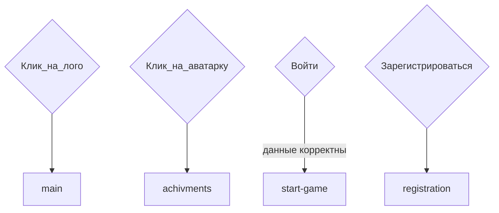

# Login. Страница входа
## Структура сраницы login
<details>
<summary>login</summary>

```
login-form
  login-form__img-container
    login-form__img
  login-form__form
    login-form__valid
    login-form__label
      login-form__input
      login-form__error
    login-form__label
      login-form__input
      login-form__error
    login-form__btn
    login-form__register
      p - text
      a - link
```

</details>

## Файловая структура страницы
* Стили в `scss/login.scss`
* Инклюды в `components/login`
* картинки в `images/login-register`
* Скрипт валидации в `js/login.js`

## Ссылки и переходы


## Задачи
### **Глобальные задачи**
- [x] Сверстать по шаблону.
Не забыть, что нужна `<p>` для вывода ошибок под полями `имя пользователя`, `пароль` и кнопкой `войти`
И ещё важный момент: вверху формы должен быть дополнительный `<p>`, в котором выведется сообщение "регистрация прошла успешно" в случае успешной регистрации и возврата на страницу `login` из `registration`.
- [x] Написать скрипт js для первичной обработки формы:
Если пусто в `имя пользователя` или `пароль`. Давай сразу с `Event.preventDefault()`.

## Для бэк-енда
1. После успешной авторизации переходим к `start-game`
***
[🠔 Вернуться к разделу разработки front-end](https://github.com/KirGenHeart/documentation/blob/main/front-end/front-end-dev.md)