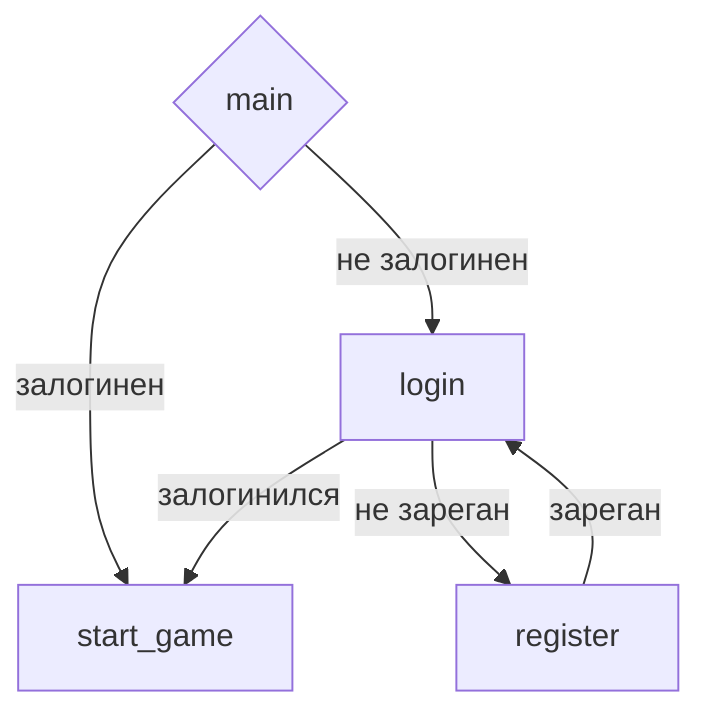

# Main. Главная страница

```mermaid
graph TD;
	main{main} -- "не залогинен" --> login
	main{main} -- залогинен --> start_game
	login -- залогинился --> start_game
	login -- не зареган --> register
	register -- зареган --> login
```
***
[🠔 Вернуться к разделу разработки front-end](https://github.com/KirGenHeart/documentation/blob/main/front-end/front-end-dev.md)