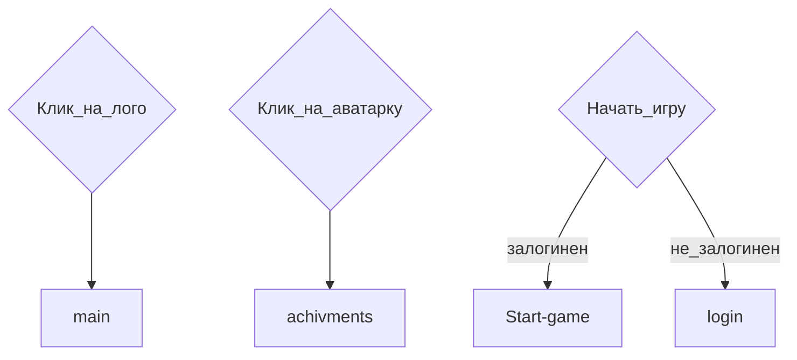

<style>
	.blue {
		color: #00A2E8;
	}
	.red {
		color: #ED1C24;
	}
</style>

# Main. Главная страница
## Структура сраницы main
* `main-description`
* `main-quote`
* `main-features`
* `main-reviews`
* `main-author`
* `main-start-game`

## Файловая структура страницы
картинки в `images/main`

## Ссылки и переходы


## Задачи
### **Глобальные задачи**
- [ ] Сверстать по шаблону.
- [ ] Поиграться с эффектами для ВСЕХ элементов страницы. Для ВСЕХ, КАРЛ!
### **main-description**
- [ ] Подумать, как лучше разделить экран пополам, включая адаптив. flex?
- [x] <span class="blue">Придумать вступительный текст.</span>
```
Сердце Киргена: тайна сгоревшей пижамы - это уникальная экспериментальная Визуальная новелла!

Это не просто игра, это эксперимент, который изменит вашу жизнь навсегда! Вы попадете в абсурдный мир, где вам придется общаться, флиртовать и сражаться с самыми невероятными существами!

Вы сами выбираете свою судьбу - каждое ваше действие влияет на ход сюжета и исход истории. Будьте осторожны - ваши решения могут иметь непредсказуемые последствия не только для вас, но и для всего мира! 😱

При разработке игры ни один КирГен не пострадал. Но это не значит, что вы не пострадаете. Вы готовы к самому безумному приключению в своей жизни?
```
### **main-features**
- [x] <span class="blue">Придумать текст для фишек</span>
```
1. “Революционный геймплей” - “Такого вы раньше не видели! Персонажи игры ведут себя как живые люди! (Если бы живые люди были упоротыми заскриптованными роботами) Порой эта игра переходит с экрана вашего гаджета в реальную жизнь! (Например, если ваш сосед Борис узнает, что вы играете в эту игру - велик риск получить по морде.) Таких живых эмоций вы не встретите больше ни в одной игре!”

2. “Неожиданные сюжетные повороты” - “Вы никогда не знаете, что ждет вас за следующим углом! Концовка может быть счастливой, трагичной, комичной или даже эротичной! Все зависит от ваших выборов и случайных событий! Но будьте осторожны - иногда сюжетные повороты могут быть слишком неожиданными и шокирующими! Например, вы можете раскрыть чдовищный, всеобъемлящий заговор, в котором замешаны депутаты госдумы Кыргызстана и беларусские торговцы межгалактическими муравьедами! 😱”

3. “Полное погружение” - “Вы сможете не только видеть, слышать и читать, но и ощущать запахи, вкусы и прикосновения! Вы сможете общаться с персонажами игры не только с помощью текста, но и с помощью голоса, жестов и мимики! Вы сможете влиять на окружающую среду и менять ее по своему желанию! Например, вы можете в полной мере ощутить себя бумерангом, примерить на себе роль разгневанного капитана фанатов Розенбаума или гиперпространственного дегенерата!"

4. “Харизматичные персонажи” - “Вы встретите множество удивительных персонажей! Вы сможете подружиться, поссориться, посмеяться, поспорить, поцеловаться и даже устроить революцию вместе с ними! С кем из персонажей сведёт вас судьба? С КирГеном? С поваром, который любит несвежие шутки? С кинологом Ибрагимом, который безуспешно пытается научить свою собаку ходить по потолку? Или со злобным духом по имени Казах-Машина?”

5. “Полная свобода действий” - “Вы можете делать все, что вам вздумается, без ограничений и последствий! Например, вы можете порвать свою куртку, опрокинуть унитаз, продать дрель осьминогу по спекулятивной цене, кусать людей за задницу, кричать «Слава носорогам!», есть мох, подкормливать блох или даже стать президентом клуба выживших после концерта Петросяна!”

6. “Любовь!” - "Много любви! По ходу игры вы испытаете самые сильные и прекрасные чувства! Добейся сердца Киргена, и счастье будет безграничным! (Но это не точно)”
```
### **main-reviews**
- [ ] Найти фотки несчастных, которые будут комментить. Их в `images/main`
- [x] <span class="blue">Придумать текст отзывов.</span>
```
Иван, 30 лет - “Эта игра прямиком из преисподней! Жаль потраченного времени. Если бы передо мной поставили выбор - ещё раз пройти эту игру или поучаствовать в оргии с бомжами, то я, ни на миг не сомневаясь, выбрал бы второе!”

Мария, 14 лет - "Спасибо автору игры за этот опыт. Теперь, узнав из вашей игры немного больше об отношениях и романтике, я никогда не смогу завести здоровых и крепких отношений. А ещё теперь я вскакиваю по ночам в холодном поту, потому что мне снятся эпизоды из вашей игры."

Клавдия Никитична, 75 лет - "Поиграв в эту игру 5 минут у меня появилось острое желание облить автора игры бензином, и поджечь его. Теперь я не могу спокойно спать, потому что усердно работаю, чтобы накопить на пулемёт, с помощью которого я превращу автора этой игры в дуршлаг. Пожалуйста, удалите эту игру из интернета - может тогда у наших потомков будет будущее!"
```
### **main-author**
- [x] <span class="blue">Придумать текст для инфы об авторе</span>
```
Денис Гагарин - самый талантливый и уникальный геймдизайнер современности. Он обучался основам юмора у непревзойдённых представителей этого жанра – Евгения Петросяна, Юрия Гальцева и Елены Степаненко. Основам драматургии и сценарного мастерства его обучил алкоголик дядя Витя, в собственном гараже. Искусству кодинга Денис обучился по перфокартам тайного общества учеников 4Б класса, которые обладали невероятными знаниями и секретами, но к сожалению, все они погибли в результате неудачного эксперимента с микроволновкой.
```
***
[🠔 Вернуться к разделу разработки front-end](https://github.com/KirGenHeart/documentation/blob/main/front-end/front-end-dev.md)