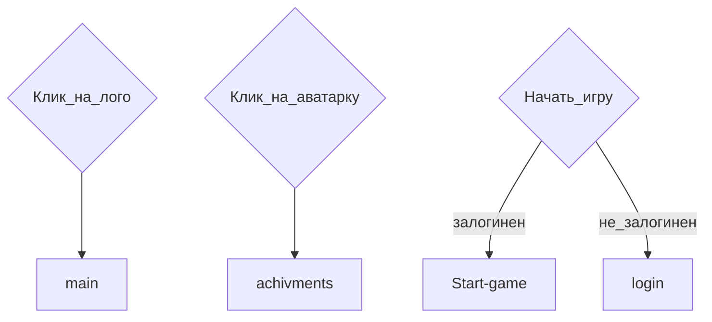

# Main. Главная страница
## Структура сраницы main
* `main-description`
* `main-quote`
* `main-features`
* `main-reviews`
* `main-author`
* `main-start-game`

## Файловая структура страницы
картинки в `images/main`

## Ссылки и переходы

## Задачи
### **Глобальные задачи**
- [ ] Сверстать по шаблону.
- [ ] Поиграться с эффектами для ВСЕХ элементов страницы. Для ВСЕХ, КАРЛ!
### **main-description**
- [ ] Подумать, как лучше разделить экран пополам, включая адаптив. flex?
- [ ] Придумать текст
### **main-features**
- [ ] Придумать текст для фишек
### **main-reviews**
- [ ] Найти фотки несчастных, которые будут комментить. Их в `images/main`
- [ ] Придумать текст тозывов. 
### **main-author**
- [ ] Придумать текст для инфы об авторе
***
[🠔 Вернуться к разделу разработки front-end](https://github.com/KirGenHeart/documentation/blob/main/front-end/front-end-dev.md)