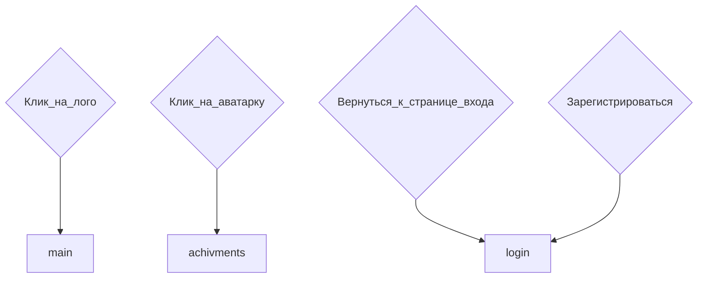

# Registration. Страница регистрации
## Структура сраницы registration
<details>
<summary>login</summary>

```
Она такая обширная, шо пздц. Тебе лень в код заглянуть???
```

</details>

## Файловая структура страницы
* Стили в `scss/register.scss`
* Инклюды в `components/register`
* картинки в `images/login-register`
* Скрипт выбора аватара в `js/avatarSelect.js`
* Скрипт валидации в `js/register.js`

## Ссылки и переходы


## Задачи
### **Глобальные задачи**
- [x] Сверстать по шаблону.
Не забыть, что у каждого поля, в т.ч. чекбокса должен быть дополнительный `<p>` для сообщений об ошибках и т.п.
- [x] Придумать структуру формы, со всеми полями. Добавь сюда, в этот пункт.
  <details>	
	<summary>Структура формы</summary>

	* `<Input>` * «Имя пользователя»
	* `<Input>` * «Пароль»
	* Псевдо`<select>` * Выбери аватар. Я накидал тестовый код блока, он 	здесь, в папке materials/pseudoSelect
	* `<Select>` * «Размер левой ноги»
	* `<Select>` * «Размер правой ноги»
	* `<Input>` * «Цвет ваших любимых штанов»
	* `<Checkbox>` «Я люблю картошку»
	* `<Checkbox>` «Надо мной проводились опыты, связанные с подозрением, 	что эволюция человека пошла вспять»
	* `<Checkbox>` * «Я понимаю, что автор не несёт ответственности за 	моё ментальное здоровье, и возможные психологические травмы, 	которые я получу во время прохождения игры»

	* Обязательные пункты отмечены *, без этого регистрация невозможна

	</details>

- [x] Написать скрипт js для первичной обработки формы, давай сразу с `Event.preventDefault()`. Валидатор будет зависеть от пунктов.
  <details>	
	<summary>Структура формы</summary>

	* Если не заполнены обязательные, под пунктами появляется `<p>` с 	информацией, что это поле обязательно, валидация не пройдена.
	* `<p>` для других пунктов. Текст появляется после ввода 	пользователем данных
	  * Имя пользователя - только при валидации, если поле пустое
	  * Пароль - только при валидации, если поле пустое
	  * Размер ног:
	  	* Если выбран огромный - "Нифига себе у тебя ноги)))"
	  	* Если разные - "И какогово тебе живётся с разными ногми, 	бедолага? 😕"
	  	* Если разнос очень большой, больше 10 размеров - "ты чё, 	рандомно сгенерированный персонаж из sims что-ли?)))"
	  * Цвет штанов, при уходе фокуса с инпута (рандомно):
	  	* "Прекрасный цвет! Мой любимый!"
	  	* "Жесть. тебе правда нравится этот цвет?"
	  	* "Это прекрасный цвет, он напоминает мне о губной гармошке"
	  	* "Теперь, когда я знаю твой любимый цвет, я больше не хочу с 	тобой дружить("
	  	* "Чудесный цвет! У меня был верблюд такого цвета!"
	  	* "Этот цвет ассоциируется у меня с налётами диких гусей("
	  	* "Это очень холодный цвет. Ты не замерзаешь в этих штанах?"
	  	* "Я думал что такой цвет носят только недоразвитые("
	  	* "Крутой цвет! Самый лучший, если хочешь отпугнуть от себя 	людей!"
  
  	</details>

## Для бэк-енда
1. После успешной регистарции переходим к `login`, в `login` информируем, что регистрация прошла успешно, пожалуйста, авторизируйтесь.
***
[🠔 Вернуться к разделу разработки front-end](https://github.com/KirGenHeart/documentation/blob/main/front-end/front-end-dev.md)