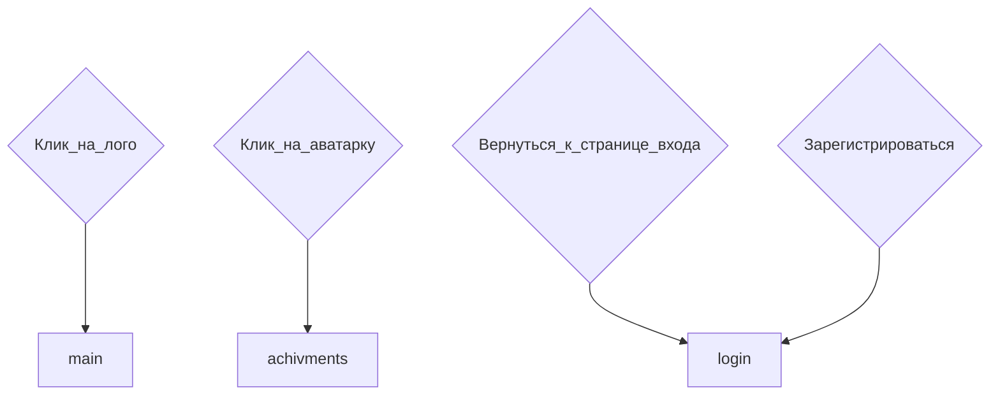

# Registration. Страница регистрации
## Структура сраницы registration

## Файловая структура страницы

## Ссылки и переходы

## Задачи
### **Глобальные задачи**
- [ ] Сверстать по шаблону.
Не забыть, что у каждого поля, в т.ч. чекбокса должен быть дополнительный `
` для сообщений об ошибках и т.п.
- [ ] Придумать структуру формы, со всеми полями. Добавь сюда, в этот пункт.
- [ ] Написать скрипт js для первичной обработки формы, давай сразу с `Event.preventDefault()`. Валидатор будет зависеть от пунктов.
***
[🠔 Вернуться к разделу разработки front-end](https://github.com/KirGenHeart/documentation/blob/main/front-end/front-end-dev.md)