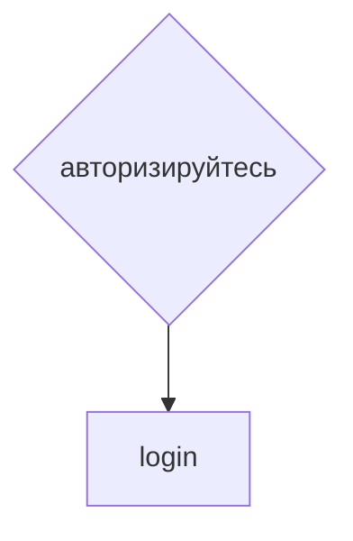

# achivments (достижения)
## Структура pop-up achivments

## Файловая структура страницы

## Ссылки и переходы

## Задачи
### **Глобальные задачи**
- [ ] Сверстать по шаблону.
- [ ] Написать скрипт js для выскакивания. Наличие определённых концовок буду инклюдить через php.
- [x] Придумать содержание pop-up. Вообще, это у нас pop-up. Пусть будет вылетать справа - как в десктопе, так и в мобилке.
* **Концовки** *- все открытые пользователем концовки. При клике на конкретную концовку аккордионом открывается краткое описание концовки.*
* **Гамоверы** *- все открытые пользователем гамоверы. При клике на конкретную концовку аккордионом открывается краткое описание концовки.*
* **Если не авторизован** *- Чтобы видеть свои достижения, пожалуйста, **авторизируйтесь*** Тут переходим к `login`
***
[🠔 Вернуться к разделу разработки front-end](https://github.com/KirGenHeart/documentation/blob/main/front-end/front-end-dev.md)